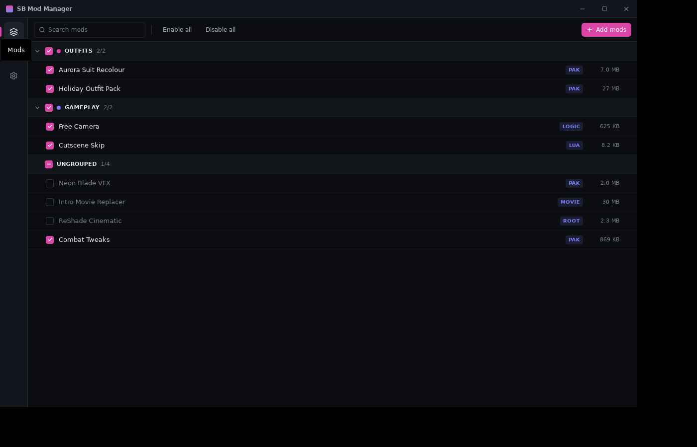

# SB Mod Manager

A mod manager for **Stellar Blade** (PC). It works out what a downloaded
archive is, puts each piece where the game expects it, and can put the game
folder back exactly as it found it.



## Why this exists

Stellar Blade mods do not all go in one place. A pak goes in `~mods`, a
Blueprint mod goes in `LogicMods` and will not work in `~mods`, a Lua mod needs
its own folder *and* a line in UE4SS's `mods.txt`, ReShade goes next to the
executable, and CNS packages ship a whole `SB/` tree to overlay. Getting this
wrong is the usual reason a mod "doesn't work".

## What it does

- **Detects the mod type and destination.** Eight layouts are recognised from
  structural markers rather than guesswork, and a single archive can contain
  several — a logic mod bundled with a cosmetic pak is routed as two
  independent components. When nothing is conclusive it asks once and
  remembers the answer.
- **Handles IoStore properly.** Stellar Blade is UE 4.26 with IoStore, so pak
  mods are `.pak`/`.utoc`/`.ucas` triplets that must share a base name and end
  in `_P`. Missing suffixes are fixed, incomplete sets are flagged.
- **Load order that actually applies.** `~mods` is mounted alphanumerically, so
  priority is written into the deployed file names (`0010_Outfit_P.pak`) with
  every file of a set renamed together. Logic mods are left alone, because
  UE4SS resolves those itself.
- **Enable and disable one mod, a group, or everything**, with the game folder
  reconciled in a single pass.
- **Installs a batch in one go.** Drop or pick any number of archives; the ones
  it recognises install themselves and the rest queue up to be asked about, so
  nothing in the batch is lost.
- **Downloads from Nexus Mods.** Pressing *Mod Manager Download* on a mod page
  hands the file to the manager, which fetches it, works out what it is and
  installs it without another click. Nexus only gives direct links to Premium
  accounts, and that gate is respected rather than worked around: on a free
  account the manager opens each mod page for you and picks the link up from
  the button, which is one click per mod and nothing else. The queue survives
  a restart, and a part-downloaded file resumes rather than starting over.
- **Installs collections.** Paste a collection link and it lists what is in
  there, marks what you already have, and lets you pick the optional entries.
  Everything selected goes into the same queue, so Premium installs the lot
  unattended and a free account is one click per mod. Entries hosted off Nexus
  cannot be fetched for you and are listed separately rather than silently
  skipped — a collection that quietly drops them looks installed while the
  game is still missing mods.
- **Says which mod is actually winning.** Two mods can both be installed, both
  be enabled, and only one of them be doing anything, because they replace the
  same asset and the game loads whichever mounts last. The manager reads the
  `.pak` and `.utoc` indexes — only the indexes, so a scan costs kilobytes
  however large the mod is — and names the asset, the mods claiming it, and the
  one that reaches the game. Moving a mod down the load order changes the
  answer, so the list is something to act on rather than read.
- **Keeps the library where you want it.** Mods and backups can live on another
  drive; only the small database stays in the app data folder. If the library
  ends up on a different drive from the game, the app says so, because hard
  links stop working there and every enabled mod is then stored twice.
- **Updates DLSS and FSR.** Both ship as plain DLLs with a stable ABI within a
  release line, so a newer one can be dropped in without waiting for a game
  patch. Files come from the vendors' own repositories — `NVIDIA/DLSS` and the
  FidelityFX SDK — and the offer is narrowed by what the card can actually run
  and by which line the game is built against, so nothing is installed that the
  game would ignore or the hardware could never load. The swap goes through the
  same deployment record as a mod, so it undoes exactly.
- **Says so on Discord**, if you want it to. Counts only — never the name of a
  mod, a collection or a folder — and one switch in Settings turns it off.
- **Updates itself** from GitHub releases, on either the stable or the nightly
  channel, with the download checked against a signature before anything is
  replaced.
- **Leaves nothing behind.** Every file written and every original displaced is
  recorded, so disabling everything restores the folder byte for byte —
  including removing directories and the `mods.txt` it created, while never
  touching a file it did not put there.

## Status

Everything the plan set out is built and covered by tests. Two things are
worth knowing before the first real run:

- **The collection lookup has not met the live API.** Nexus does not publish
  its v2 GraphQL schema and the domain is unreachable from CI, so the query
  was written from the documented shape and the response is read by walking
  it for anything carrying a mod and file id rather than by a fixed path.
  That survives a renamed wrapper, but not a renamed `collectionRevision`
  itself. The `collection.json` inside the revision archive is the tested
  path and is preferred whenever the response offers a link to it.
- **The upscaler check needs GitHub.** Listing releases uses the public
  GitHub API, which is rate limited for anonymous callers; when it refuses,
  the screen says it could not check rather than claiming you are up to date.

Not built:

- ProjFS virtual filesystem as an alternative to hard-linking
- Profiles (the schema already stores state per profile)

## Building

Requires Rust 1.82+, Node 22+ and pnpm. On Windows you also need the WebView2
runtime, which ships with Windows 11 and recent Windows 10.

```sh
pnpm install
pnpm tauri dev      # run it
pnpm tauri build    # produce an installer
```

Releases are automated: pushing a `v*` tag builds the Windows installer and
publishes a GitHub Release with notes generated from the commits since the
last tag, and a rolling `nightly` prerelease is rebuilt from `master` whenever
something landed that day. The app version comes from `package.json` alone —
`tauri.conf.json` points at it.

### Discord presence (optional)

Presence needs a Discord application id, and the one in `src-tauri/src/discord.rs`
is a placeholder — nothing appears until it is replaced. Register an
application at <https://discord.com/developers/applications>, put its id in
`APP_ID`, and upload an image named `icon` under its Rich Presence art assets
so the large icon resolves. Everything else works without this; the feature
just stays invisible.

### Update signing (do this before the first release)

The app updates itself from these releases and refuses anything without a
valid signature, so the repository needs its own signing keypair. The public
key committed in `tauri.conf.json` is a placeholder that only keeps local
builds valid — nobody holds its private half, so replace it:

```sh
pnpm tauri signer generate -w .tauri/updater.key
```

Then:

1. Paste the contents of `.tauri/updater.key.pub` into `plugins.updater.pubkey`
   in `src-tauri/tauri.conf.json`.
2. Add the contents of `.tauri/updater.key` as the repository secret
   `TAURI_SIGNING_PRIVATE_KEY`, and its password as
   `TAURI_SIGNING_PRIVATE_KEY_PASSWORD`.
3. Keep `.tauri/updater.key` somewhere safe. Losing it means existing installs
   can no longer be updated — they will reject builds signed with a new key.

## Architecture

The manager is a Rust workspace of platform-free library crates plus a thin
Tauri shell. Everything worth testing lives in the libraries, so the test suite
runs on any machine — `src-tauri` is only command wrappers.

| Crate | Responsibility |
| --- | --- |
| `sbmm-core` | Mod type detection over a normalised file tree, pak set grouping, load-order naming, deployment planning |
| `sbmm-deploy` | `DeployBackend` trait, hard-link backend, the manifest that makes removal exact, UE4SS `mods.txt` syncing |
| `sbmm-game` | Steam and Epic install discovery, including a small KeyValues parser |
| `sbmm-archive` | zip/7z/rar extraction with path-traversal protection |
| `sbmm-assets` | Reading `.pak` and `.utoc` indexes to find out what a mod replaces |
| `sbmm-store` | SQLite persistence: mods, groups, per-profile state, deployment record |
| `sbmm-nexus` | Nexus REST/GraphQL client, `nxm://` parsing, rate limits, the download queue |
| `sbmm-upscaler` | Finding DLSS/FSR DLLs, reading their PE version, GPU capability rules, vendor release catalogue |
| `sbmm-app` | The application service the UI drives |
| `src-tauri` | Tauri commands, window, bundling |

Mods are kept unpacked in the library folder and hard-linked into the game when
enabled. Links cost no extra disk space and are indistinguishable from real
files to the game, and the game folder holds nothing while a mod is disabled.
The library defaults to the app data directory and can be moved anywhere; only
`sbmm.db` stays behind, because it has to be found before any setting can be
read.

`src-tauri` is deliberately its own Cargo workspace: it needs WebView2/WebKit
system libraries, and keeping it separate lets `cargo test --workspace` run the
domain crates on any platform.

### Where mods are installed

All paths are relative to the folder containing `SB/`.

| Type | Marker | Destination |
| --- | --- | --- |
| Pak | `.pak` (+ `.utoc`/`.ucas`) | `SB/Content/Paks/~mods/` |
| Logic mod | a `LogicMods` directory | `SB/Content/Paks/LogicMods/` |
| UE4SS Lua | `scripts/main.lua` | `SB/Binaries/Win64/ue4ss/Mods/<Name>/` + `mods.txt` |
| UE4SS C++ | `dlls/main.dll` | as above |
| UE4SS runtime | `UE4SS.dll` | `SB/Binaries/Win64/` |
| Root / ReShade | `ReShade.ini`, a proxy DLL | `SB/Binaries/Win64/` |
| Movie | `.mp4`/`.bk2`, a `Movies` directory | `SB/Content/Movies/` |
| Game root overlay | an explicit `SB/` tree | laid onto the game folder |

## Development

```sh
cargo test --workspace          # domain crates
cargo clippy --workspace --all-targets
pnpm typecheck

# Populate a fake install to exercise the UI without owning the game.
# An optional third argument relocates the mod library first.
cargo run -p sbmm-app --example seed -- <data-dir> <game-root> [library-root]

# Regenerate the icon set (no image dependencies needed)
python3 scripts/make-icons.py
```

The app's data directory is `%APPDATA%/dev.sbmm.manager` on Windows and
`~/.local/share/dev.sbmm.manager` on Linux.

## Licence

MIT
